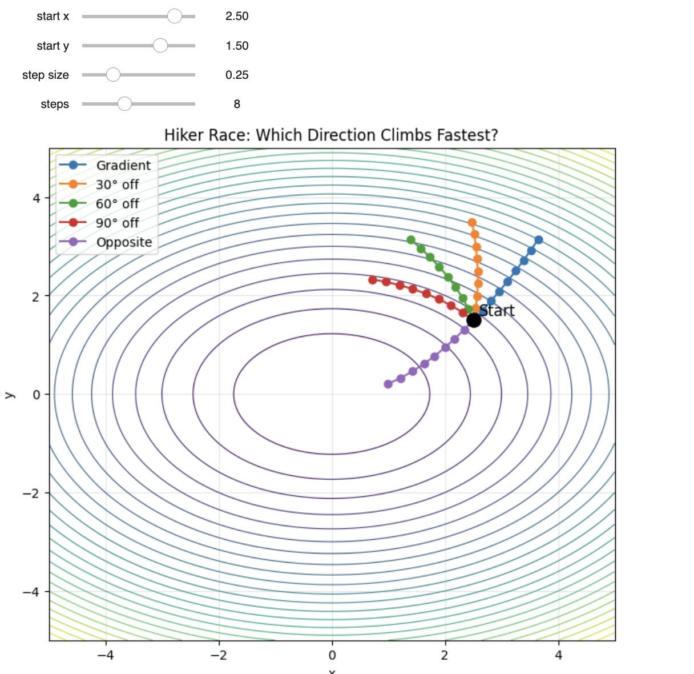

# gradient-interactive-notebook

This is an interactive teaching sample. The Gradient: Climbing the Mountain Fastest in the Fog.

This notebook teaches the intuition behind gradients through a mountain-climbing analogy with an interactive hiker race showing why the gradient wins

Open the notebook here: [Sample1_InteractiveGradient_.ipynb](Sample1_InteractiveGradient_.ipynb)

